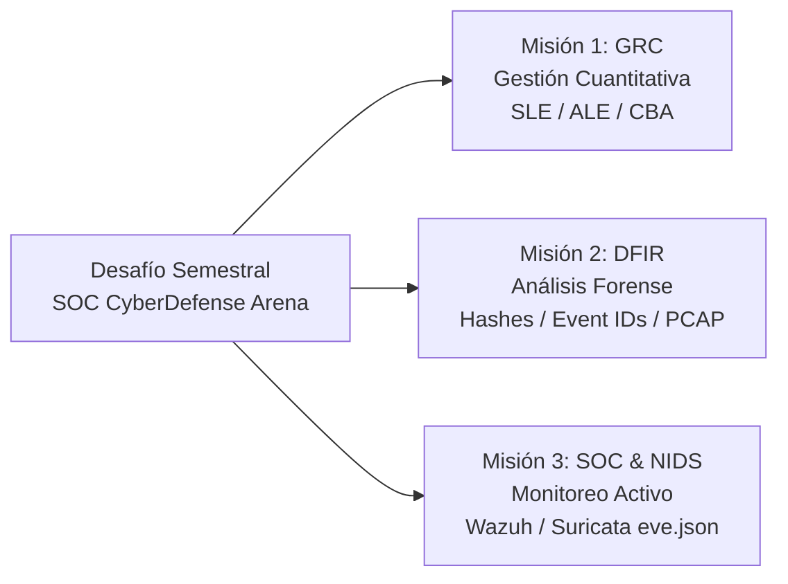

# 🛡️ SOC CyberDefense Arena - Desafío Semestral
### Asignatura: Ciberseguridad Defensiva (OCY1105 / CSY6122 / CSY1102)
**Organización Evaluada:** NetChile Corp / Soluciones Tecnológicas SPA  
**Coordinación:** Lead DevSecOps & Coordinación Académica de Ciberseguridad  

---

## 📌 1. Visión General del Desafío

Bienvenido al repositorio oficial del desafío **SOC CyberDefense Arena**. En este proyecto semestral, cada equipo asumirá el rol de una célula operativa del **Centro de Operaciones de Seguridad (SOC / CSIRT)** encargada de proteger la infraestructura crítica de **NetChile Corp / Soluciones Tecnológicas SPA**.

La organización ha sido blanco de campañas avanzadas de ciberataques que combinan explotación de vulnerabilidades web (RCE), compromiso de cuentas de servicio, movimiento lateral con persistencia en servicios de Windows y exfiltración encubierta de datos a través de canales DNS/ICMP/HTTP.

El objetivo formativo es auditar, defender y responder ante los incidentes mediante tres misiones integrales que abarcan desde el análisis financiero cuantitativo del riesgo hasta la correlación de eventos en SIEM/NIDS y el análisis forense digital.

---

## 🎯 2. Desglose de las 3 Misiones Formativas



### 🔹 Misión 1: GRC & Gestión Cuantitativa del Riesgo de Ciberseguridad
- **Objetivo:** Cuantificar el impacto financiero de las amenazas y justificar ante el Directorio la inversión en salvaguardas de seguridad mediante métricas formales.
- **Fórmulas de Verificación Obligatorias:**
  - **Pérdida Única Esperada:**
    $$SLE = AV \times EF$$
  - **Pérdida Anualizada Esperada:**
    $$ALE = SLE \times ARO$$
  - **Análisis Costo-Beneficio (Beneficio Neto):**
    $$CBA = (ALE_{inicial} - ALE_{mitigado}) - Costo\_Control$$
  - **Retorno de Inversión en Seguridad:**
    $$ROSI = \left(\frac{CBA}{Costo\_Control}\right) \times 100\%$$
- **Guía Técnica:** Consultar [`docs/guia_mision_1_grc.md`](docs/guia_mision_1_grc.md).
- **Plantilla Tabular:** [`templates/matriz_riesgos_cba.csv`](templates/matriz_riesgos_cba.csv).

---

### 🔹 Misión 2: DFIR & Análisis Forense Digital
- **Objetivo:** Investigar la intrusión, extraer artefactos maliciosos, auditar los registros de autenticación y reconstruir la cadena de ataque en red y endpoints.
- **Artefactos Obligatorios a Auditar:**
  - **Hashes Criptográficos:** Identificación de binarios mediante SHA-256 (64 caracteres).
  - **Event IDs de Windows Security:**
    - `Event ID 4624`: Inicios de sesión exitosos (Logon Type 2, 3 y 10 - RDP).
    - `Event ID 4697`: Instalación de servicios maliciosos para persistencia (MITRE T1543.003).
    - `Event ID 4688`: Creación de procesos y parámetros ofuscados en `CommandLine`.
  - **Filtros Wireshark & tshark:**
    - HTTP POST: `http.request.method == "POST"` (Exfiltración y C2).
    - DNS: `dns.flags.response == 0` (Consultas anómalas / DGA / Tunneling).
    - ICMP: `icmp.type == 8 && frame.len > 128` (Túneles encubiertos).
  - **Forense Linux:** Registros de fuerza bruta SSH y abuso de sudo en `/var/log/auth.log`.
- **Guía Técnica:** Consultar [`docs/guia_mision_2_dfir.md`](docs/guia_mision_2_dfir.md).
- **Playbook de Incidentes:** [`templates/playbook_ransomware_template.md`](templates/playbook_ransomware_template.md) (bajo estándar NIST SP 800-61 Rev. 2).

---

### 🔹 Misión 3: SOC & NIDS (Wazuh SIEM y Suricata eve.json)
- **Objetivo:** Desplegar y configurar la infraestructura de monitoreo continuo, asegurando la correlación de eventos en tiempo real y la respuesta activa.
- **Componentes Obligatorios:**
  - **Wazuh SIEM:** Despliegue de Manager y enrolamiento de agentes activos (Linux / Windows).
  - **Monitoreo de Integridad de Archivos (FIM):** Políticas en `ossec.conf` (`/etc/passwd`, `C:\Windows\System32\drivers\etc\hosts`).
  - **Reglas Personalizadas:** Creación de reglas XML en `local_rules.xml` (Severidad $\ge 12$).
  - **Suricata NIDS:** Parseo y correlación de alertas en `/var/log/suricata/eve.json` (detección de RCE, firmas ET, IPs agresoras y payloads de explotación).
  - **Respuesta Activa (*Active Response*):** Bloqueo dinámico de atacantes en firewall.
- **Guía Técnica:** Consultar [`docs/guia_mision_3_soc_nids.md`](docs/guia_mision_3_soc_nids.md).
- **Diagrama de Arquitectura:** [`assets/architecture_soc.md`](assets/architecture_soc.md).

---

## 🎮 3. Mecánica de Gamificación por Roles y Tiers

Cada integrante del equipo asumirá responsabilidades especializadas que aportan al puntaje del escuadrón defensivo:

| Tier | Rol Operativo | Responsabilidades Clave | Misión Principal |
| :---: | :--- | :--- | :---: |
| **Tier 1** | **SOC Analyst** (Triage & Monitoring) | Monitoreo de consola Wazuh, parseo de telemetría de Suricata en `eve.json` y correlación de eventos NIDS. | Misión 3 |
| **Tier 2** | **Incident Responder** (DFIR & Containment) | Análisis de capturas PCAP con tshark, investigación de Event IDs de Windows, `auth.log` y ejecución de playbooks NIST. | Misión 2 |
| **Tier 3** | **Lead DevSecOps / Threat Hunter** (GRC & Arch) | Modelado cuantitativo de amenazas ($SLE$, $ALE$, $CBA$), diseño de reglas de detección y justificación directiva. | Misión 1 |

---

## 📊 4. Rúbrica Oficial de Evaluación (Escala 1.0 a 7.0 al 60% de Exigencia)

La calificación global se calcula a partir de la ponderación de las tres misiones:
$$\text{Puntaje Global (\%)} = (0.30 \times \text{Misión 1}) + (0.35 \times \text{Misión 2}) + (0.35 \times \text{Misión 3})$$

### 📐 Fórmula de Calificación (Escala Chilena 1.0 - 7.0 al 60% de Exigencia):

$$\text{Nota Final} = \begin{cases} 
1.0 + 3.0 \times \left(\dfrac{\text{Puntaje Global}}{60.0}\right) & \text{si } \text{Puntaje Global} < 60.0\% \\ 
4.0 + 3.0 \times \left(\dfrac{\text{Puntaje Global} - 60.0}{40.0}\right) & \text{si } \text{Puntaje Global} \ge 60.0\% 
\end{cases}$$

### 🎯 Escala de Niveles por Misión (100%, 80%, 60%, 30%, 0%):

| Nivel (%) | Gestión de Riesgos (M1 - 30%) | DFIR & Forense (M2 - 35%) | SOC & NIDS (M3 - 35%) |
| :---: | :--- | :--- | :--- |
| **100%** | Fórmulas exactas de $SLE$, $ALE$ (inicial y mitigado) y $CBA$ positivo con justificación financiera impecable. | Hashes SHA-256 válidos, Event IDs (4624, 4697, 4688) interpretados, filtros Wireshark completos y auth.log analizado. | Wazuh Manager con agentes activos, FIM configurado y parseo exhaustivo de alertas de Suricata en `eve.json`. |
| **80%** | Cálculos correctos con variaciones mínimas de redondeo o formato. CBA consistente. | Cubre la mayoría de artefactos pero con omisión de un detalle menor (ej. falta filtro ICMP o Event ID 4697). | Despliegue funcional de Wazuh y análisis de `eve.json` con evidencia parcial de correlación. |
| **60%** | Aplica fórmulas pero presenta errores en $ALE$ o falta justificación del costo del control. | Artefactos forenses aislados sin correlación completa entre eventos de endpoint y tráfico de red. | Implementación básica de Wazuh o Suricata sin correlación entre alertas y agentes. |
| **30%** | Mención conceptual de riesgos sin aplicación rigurosa de fórmulas cuantitativas. | Conceptos genéricos sin hashes, sin sintaxis real de filtros ni Event IDs específicos. | Mención de herramientas sin evidencia de configuración ni análisis real de logs. |
| **0%** | No presenta gestión de riesgos. | No presenta evidencia forense. | No presenta evidencia de SOC ni NIDS. |

---

## 🚀 5. Estructura del Repositorio

```text
soc-autograder/
├── README.md                                  # Documento maestro del desafío semestral
├── .gitignore                                 # Exclusiones de Git (entornos, claves, temporales)
├── grader.py                                  # Pipeline de evaluación con Google GenAI SDK
├── consolidado_notas.csv                      # Reporte consolidado de calificaciones generado
├── docs/                                      # Guías formativas paso a paso
│   ├── guia_mision_1_grc.md                   # Guía de Gestión Cuantitativa del Riesgo
│   ├── guia_mision_2_dfir.md                  # Guía de Análisis Forense Digital (DFIR)
│   └── guia_mision_3_soc_nids.md              # Guía de SOC & NIDS (Wazuh / Suricata)
├── templates/                                 # Plantillas de entrega para los estudiantes
│   ├── plantilla_informe.txt                  # Plantilla estructurada del informe técnico
│   ├── playbook_ransomware_template.md        # Plantilla Playbook NIST SP 800-61
│   └── matriz_riesgos_cba.csv                 # Plantilla tabular de análisis CBA/ROSI
├── assets/                                    # Diagramas y esquemas arquitectónicos
│   └── architecture_soc.md                    # Topología de red y diagramas de flujo Mermaid
└── entregas/                                  # Carpeta de recepción de informes de alumnos
    ├── equipo_alfa.txt                        # Ejemplo de entrega completa (100%)
    └── equipo_beta.txt                        # Ejemplo de entrega con oportunidades de mejora
```

---

# 🛡️ 6. SOC CyberDefense Arena - Desafío Semestral
### Asignatura: Ciberseguridad Defensiva (OCY1105 / CSY6122 / CSY1102)
**Organización Evaluada:** NetChile Corp / Soluciones Tecnológicas SPA  
**Coordinación:** Lead DevSecOps & Coordinación Académica de Ciberseguridad  

---

## 📌 1. Visión General del Desafío

Bienvenido al repositorio oficial del desafío **SOC CyberDefense Arena**. En este proyecto semestral, cada equipo asumirá el rol de una célula operativa del **Centro de Operaciones de Seguridad (SOC / CSIRT)** encargada de proteger la infraestructura crítica de **NetChile Corp / Soluciones Tecnológicas SPA**.

La organización ha sido blanco de campañas avanzadas de ciberataques que combinan explotación de vulnerabilidades web (RCE), compromiso de cuentas de servicio, movimiento lateral con persistencia en servicios de Windows y exfiltración encubierta de datos a través de canales DNS/ICMP/HTTP.

El objetivo formativo es auditar, defender y responder ante los incidentes mediante tres misiones integrales que abarcan desde el análisis financiero cuantitativo del riesgo hasta la correlación de eventos en SIEM/NIDS y el análisis forense digital.

---

## 🎯 2. Desglose de las 3 Misiones Formativas

```mermaid
graph LR
    A["Desafío Semestral<br>SOC CyberDefense Arena"] --> M1["Misión 1: GRC<br>Gestión Cuantitativa<br>SLE / ALE / CBA"]
    A --> M2["Misión 2: DFIR<br>Análisis Forense<br>Hashes / Event IDs / PCAP"]
    A --> M3["Misión 3: SOC & NIDS<br>Monitoreo Activo<br>Wazuh / Suricata eve.json"]

El script procesará todos los archivos `.txt` en `entregas/`, generará la retroalimentación en consola y exportará la tabla final en `consolidado_notas.csv`.
