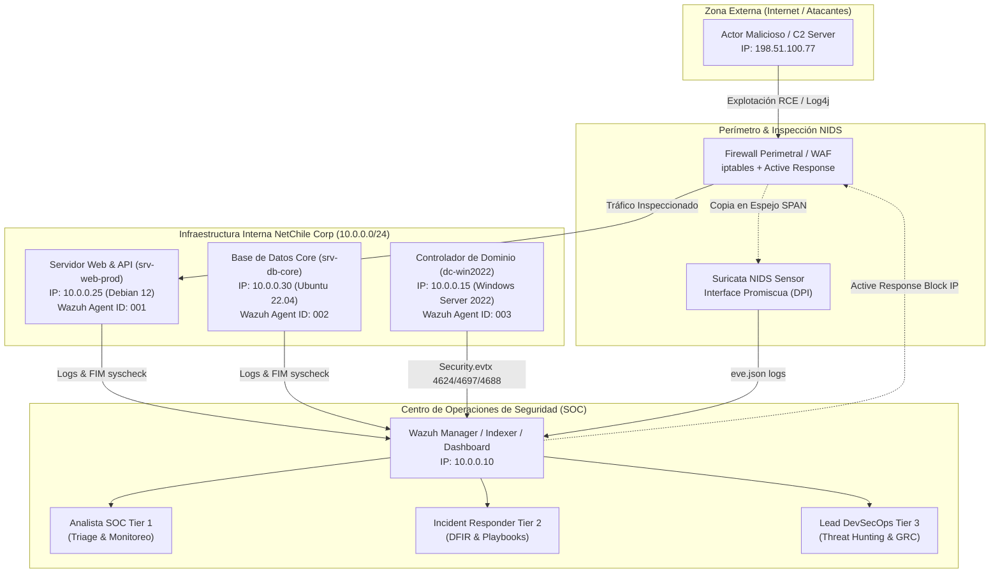
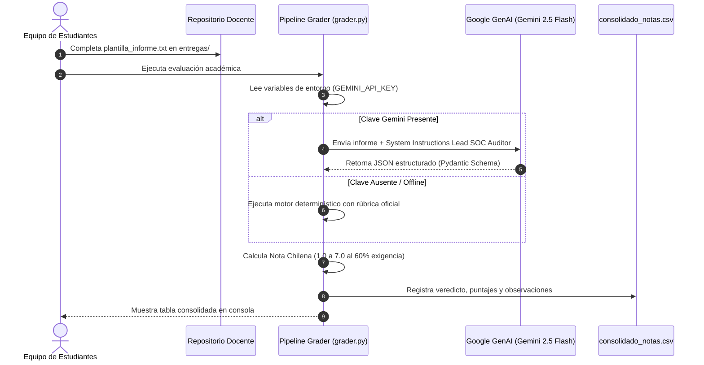

# Esquemas y Arquitectura SOC CyberDefense Arena
**Organización:** NetChile Corp / Soluciones Tecnológicas SPA  
**Entorno Operativo:** SOC / SIEM / NIDS / DFIR  

---

## 1. Diagrama de Topología de Red y Flujo de Telemetría SOC

---

## 2. Flujo de Datos y Pipeline de Evaluación Automatizada

